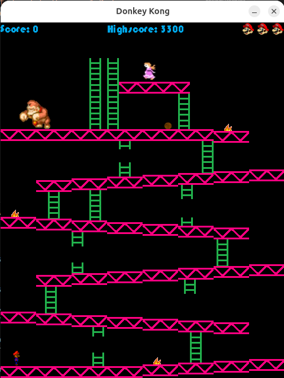

DonkeyKong User Manual

Special Libraries
	The Simple DirectMedia Layer (SDL) cross-platform development library was used to build graphics for the project. Specifically, version 1.2 of SDL was used during development. Additionally, the game was developed, tested, and run of a distribution of Red Hat Linux Enterprise v6.5.  

Compilation Instructions
    From the Unix command line, ‘git clone https://bitbucket.org/srack/donkeykong’ pulls the necessary files into a donkeykong/ folder in the current directory.  Next, the command ‘cd donkeykong’ can be used to move into the appropriate folder for compilation.  Typing ‘make’ builds the program. After proper compilation, it can be run with the command ‘./CApp’. 

User Manual
    When program is initially run, a startup screen is displayed. It shows the name of the game as well as a ‘Start’ and ‘Controls’ button. Scrolling the mouse over the ‘Controls’ button causes the user controls to be displayed - the arrow keys to move Mario as well as the spacebar to make Mario jump. Scrolling the mouse over the ‘Start’ button and clicking the mouse starts the first DonkeyKong at level 1 with Mario having three lives (symbolized by three Mario heads in the top right corner of the screen). Before each game, a screen is displayed to the user showing the respective level. Mario starts on the lower left corner of the screen and must ascend five platforms to rescue Peach at the top of the screen. On each platform exist ladders for Mario to climb in order to reach Peach by using the up arrow key. He must be in the center of the ladder in order to climb it. If Mario collides with the fire or barrels, he ‘dies’, blinks, and returns to his start position. To avoid these obstacles, the user can make Mario jump by pressing the spacebar. If Mario jumps over the fire, a ‘+200’ is displayed and incremented to the score. If he jumps over a barrel, a ‘+200’ is displayed and incremented to the score. The user’s total score is displayed at the top left of the screen, and the high score is displayed at the top center of the screen. To win the game and rescue Peach, the user must help Mario ascend the platforms by climbing the ladders and collide with Peach to ‘rescue’ her from DonkeyKong. 
    Once Mario loses all three lives, a ‘Game Over’ screen is displayed to the user - giving him or her the option to either ‘play again’ or ‘quit’. If the user clicks the ‘quit’ button, the screen closes and the program ends. If the user clicks the ‘play again’ button, however, the game returns to level one and is initialized as it began. 

Bugs
    A few bugs exist with Mario’s interaction with the ladder.  To better control behavior, the left and right arrow keys and the space bar are disabled when Mario is colliding with a ladder.  Because of how this logic is implemented, if the user stops at a ladder or starts to climb a ladder and decides to return to the platform at the bottom, Mario cannot move left or right until the down arrow is pressed and he collides with the platform.  Another bug comes with broken ladders.  If the user continues to press the up key at the top of a broken ladder, Mario’s state will switch between walking and climbing, causing undesirable graphics. Ladders are also only one way- Mario can climb up, but not back down if he has already passed through the platform.
    Another bug exists within the fire’s artificial intelligence.  The fire navigates through multiple states that determine its behavior based on its position in relation to Mario.  Initially, the fire AI was built on the premise that it would only follow Mario up ladders, not down ladders.  This caused numerous issues if Mario some how became positioned below the fire.  In the end, we found that it was not effective to add in functionality for the fire to travel down a ladder because it caused too many unforeseen errors. As a result, the fire isn’t always “smart.”  Sometimes if Mario and the fire and both traveling upward simultaneously, the fire will enter an incorrect state and choose the incorrect horizontal direction once it reaches the platform.  We found that this was usually not an issue, but it still does occur in normal gameplay.  We also feel that it may provide a sense of intelligence over the computer for the user, making the gameplay experience more enjoyable.  
    Finally, we also found a slight error that occurs with SDL audio.  We discovered that if the user is listening to audio from another source on their computer (i.e iTunes or Pandora), the game does not close correctly.  While this issue only occurred once for us, we wanted to report it. This is also is an issue within SDL and not a bug that we are capable of fixing.
 
---

## Ubuntu
Build
```shell
sudo apt install libsdl1.2-compat-dev libsdl-image1.2-dev libsdl-mixer1.2-dev libsdl-ttf2.0-dev
make
```

Run
```shell
./CApp
``` 

